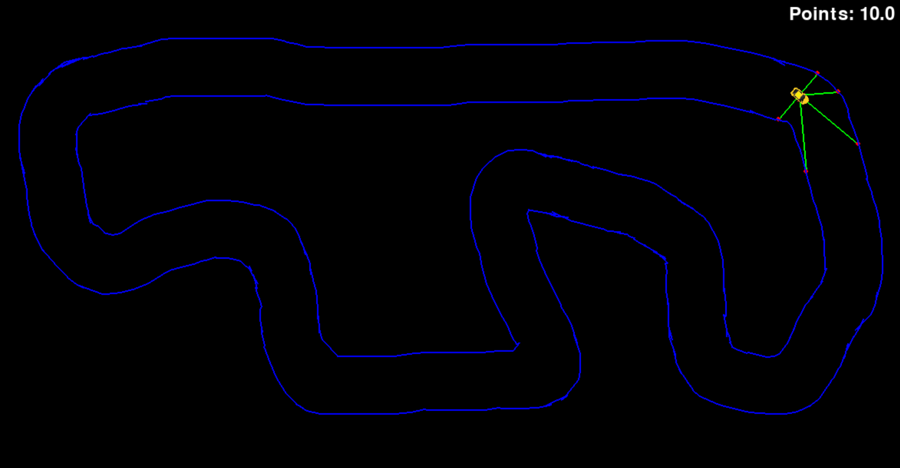

# Self-Driving Car Game 🚗💨

Welcome to the **Self-Driving Car** game, where you can witness the fascinating evolution of a genetic learning agent as it masters the art of driving! 🧬 This 2D game allows you to create custom racetracks, challenge the car's AI, and watch it learn from its mistakes. Whether you're a fan of AI, machine learning, or just love racing games, this project is sure to captivate your imagination! 🎮

 <!--You can add a real image or GIF of your game here-->

---

## Introduction 📖

The **Self-Driving Car** game is a 2D simulation where a car, controlled by a genetic learning agent, navigates various tracks. The agent uses sensors to understand its surroundings and improve its driving skills over time. The coolest part? The tracks are user-generated, meaning you can design your own challenging courses! 🏎️💡

### Key Features:

- **Genetic Learning:** The car agent evolves and adapts using genetic algorithms, improving its performance with each iteration.
- **Custom Tracks:** Design your own unique racetracks and watch the agent learn to master them.
- **Interactive Drawing:** Use intuitive drawing tools to create, edit, and perfect your tracks.
- **Real-Time Feedback:** See how the agent adapts in real-time, learning from past experiences to become a better driver.

---

## Setup the Project 🛠️

To get started with the **Self-Driving Car** game, follow these simple steps to set up the project on your local machine.

### Prerequisites:

- **Python**: Make sure you have Python installed on your system. You can download it [here](https://www.python.org/downloads/).

### Step-by-Step Setup:

1. **Clone the Repository:**

   First, navigate to the folder where you want to place the project and clone the repository using the command below:

    ```bash
    git clone <repo-link>
    ```
2. **Open the Project:**

    Open the cloned folder in your favorite code editor. (PS: Mine is VSCode :wink: )

3. **Create a Virtual Environment:**

    If you have python installed, create a virtual environment with the following command:

    ```bash
    python -m venv <environment-name>
    ```

4. **Activate the Virtual Environment:**

    Activate the environment in the command line or terminal

    ```bash
    <environment-name>\Scripts\activate
    ```

    You should see the environment name appear in your command prompt, indicating it's activated.

5. **Install Required Packages:**

    Once the environment is activated, install all the necessary packages from the requirements file:

    ```bash
    pip install -r requirements.txt
    ```

    This step may take a few moments as it installs all the required dependencies.


## Running the Project 🚀

With the project set up, you're now ready to run the **Self-Driving Car** game and start designing tracks for the AI agent.

1. **Run the Main Python File:**

    Launch the game by running the main Python file with the command:

    ```bash
    python main.py
    ```

2. **Design Your Track:**

    First Screen: Use the drawing tools to sketch out a racetrack of your choice. Get creative and design a challenging course for the AI agent! 🎨

3. **Edit Your Track:**

    Second Screen: Use the brush cleanup tool to remove excess track lines and refine your design. Make sure the track is just right for the agent to navigate. 🧹

4. **Watch the Agent in Action:**

    Third Screen: The final track appears with the car agent ready to race. Sit back and enjoy as the agent learns to drive through your custom track, improving its skills with each attempt. 🚗💨


## How the Game Works ⚙️

Here's a brief overview of how the genetic learning agent operates:

- Sensors: The car is equipped with sensors that provide data about its surroundings, such as distances to track edges.
- Genetic Algorithm: The agent uses a genetic algorithm called NEAT to evolve and improve its driving capabilities. It goes through cycles of selection, mutation, and crossover to develop better driving strategies.
- Learning Process: With each iteration, the agent analyzes its performance, adapts to the track, and learns from its mistakes, ultimately becoming a proficient self-driving car.

## Contributing 🤝

We welcome contributions from the community! If you have ideas for new features, improvements, or bug fixes, feel free to submit a pull request. Let's make the Self-Driving Car game even better together!

### Steps to Contribute:

1. **Fork the Repository:**

    Click the "Fork" button on the top-right corner of this repository page to create a copy under your GitHub account.

2. **Clone Your Fork:**

    Clone the forked repository to your local machine:

    ```bash
    git clone <your-fork-repo-link>
    ```

3. **Create a Branch:**

    Create a new branch for your feature or bug fix:

    ```bash
    git checkout -b feature-or-bug-fix-name
    ```

4. **Make Your Changes:**

    Implement your changes in the codebase.

5. **Commit Your Changes:**

    Commit your modifications with a descriptive message:

    ```bash
    git commit -m "Add feature or fix bug"
    ```

6. **Push Changes:**

    Push your changes to your forked repository:

    ```bash
    git push origin feature-or-bug-fix-name
    ```

7. **Create a Pull Request:**

    Go to the original repository and open a pull request with a detailed description of your changes.


## License 📜

This project is licensed under the GNU GENERAL PUBLIC LICENSE - see the [LICENSE file](LICENSE) for details.


## Contact 📧

Have questions or need assistance? Feel free to reach out:

[@shubanms](https://github.com/shubanms)


## Conclusion

Enjoy the Self-Driving Car game, and have fun watching AI learn to race! 🏁🎉


## Note

- You should replace placeholders like `<repo-link>`, `<environment-name>`, `<your-fork-repo-link>` with your actual data.
